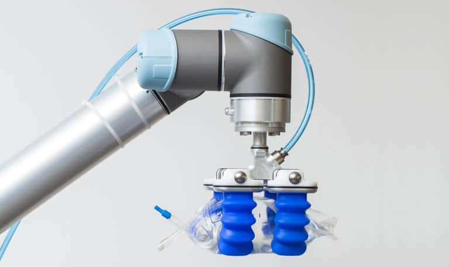

# SR_Driver

---

---

## Usage

---

follow installation and dependency instructions

roscore &
rosrun sr_driver sr_driver.py &

rostopic pub /sr_gripper std_msgs/String "data: 'open'"
rostopic pub /sr_gripper std_msgs/String "data: 'closed'"

---

## Description

---

This package is a ROS Driver for the Soft Robotics MGrip gripper. This package allows you to
control the grip easier via a ROS node. 

You publish a string with your desired state to the "/sr_gripper" node and this will handle the rest of the logic.
The default pressure limits are declared but can be easily modified. Although this was written for the UR5 arm it should
work for the entire UR series(with slight modifications). You will need to modify the pin assignments within the code to
suit your install of the gripper, or install your gripper as we installed ours.

Tested on Ubuntu 16.04 and 20 (results may vary with other distros)
communicating with a UR5 running Version 3.13 of their Polyscope software

---

## Installation

---
install all the requirements listed in the section below

git clone (this repo) ~/catkin_ws/src/
cd catkin_ws
catkin_make
chmod +x src/sr_driver/scripts/sr_driver

---

## Requirements

---

* ur_rtde python version(https://pypi.org/project/ur-rtde/) (must compile from source with python 2.7 flag if on ubuntu 16. If using python 3 just install via pip.)
* Python 2.7 or 3
* ROS Kinetic or Melodic

(If you want to regenerate documentation after any modification, not really necessary)
* Sphinx-Common
* Sphinx-Doc

---
